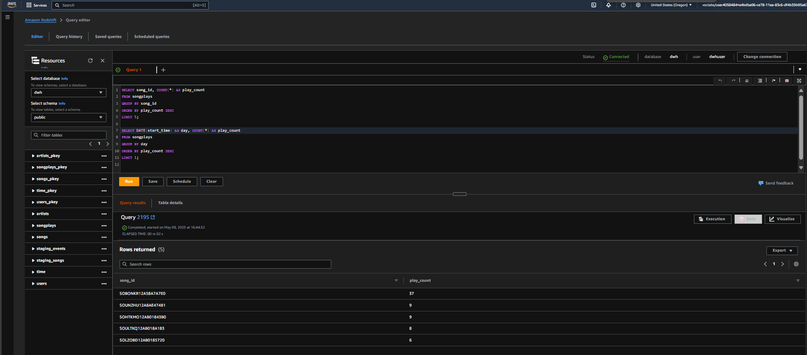

# 🌷 Sparkify Data Warehouse Pipeline on AWS Redshift

This project builds a cloud-based **Data Warehouse** for a fictional music streaming app, **Sparkify**, using AWS Redshift, S3, and Python.

---

## 📌 Project Goal

Design and implement an ETL pipeline that:

* Extracts raw song and log data from **S3**
* Loads it into **staging tables** in Amazon **Redshift**
* Transforms it into a **star-schema** data warehouse for analytics

---

## 📦 Installation

Before running any script, install the required Python libraries:

```bash
pip install -r requirements.txt
```

This installs:

* `boto3` – AWS SDK for Python
* `psycopg2-binary` – PostgreSQL adapter to connect to Redshift
* `configupdater` – For dynamic updates to config files

---

## ⚙️ Technologies Used

* **Amazon Redshift** – Cloud Data Warehouse
* **Amazon S3** – Storage for raw song & event logs (JSON)
* **IAM** – Role-based S3 access from Redshift
* **Python** – ETL scripting & automation
* **psycopg2** – PostgreSQL/Redshift connection
* **boto3** – AWS SDK for Python
* **ConfigParser + ConfigUpdater** – Dynamic config file management

---

## 📂 Folder Structure

```
.
├── create_aws_resources.py       # Provisions Redshift + IAM role (with dynamic config injection)
├── create_tables.py              # Drops & creates all tables
├── delete_aws_resources.py       # Deletes Redshift & IAM role (and resets config)
├── etl.py                        # Extracts from S3, transforms, loads into Redshift
├── sql_queries.py                # SQL commands (CREATE, COPY, INSERT)
├── utils.py                      # Helper to reset placeholders in dwh.cfg
├── dwh.cfg                       # Configuration file (dynamically updated)
├── .aws_credentials              # Your local secure AWS credentials (excluded from version control)
├── requirements.txt              # Python package dependencies
└── README.md                     # Project documentation
```

---

## 🚀 Pipeline Workflow

### 0. Configure AWS Credentials

Create a file named `.aws_credentials` in the root directory with:

```
[AWS]
KEY=YOUR_ACCESS_KEY
SECRET=YOUR_SECRET_KEY
```

**Note:** This file is ignored by `.gitignore` and keeps your credentials secure and separate from `dwh.cfg`.

### 1. `create_aws_resources.py`

* Resets `dwh.cfg` placeholders
* Creates:

  * IAM role with AmazonS3ReadOnlyAccess policy
  * Redshift cluster with public access
  * Opens port 5439
* Automatically injects:

  * The Redshift **Cluster Endpoint** into `[CLUSTER]`
  * The IAM **Role ARN** into `[IAM_ROLE]`

> ✅ No manual edits to `dwh.cfg` required. Everything is dynamically managed.

### 2. `create_tables.py`

* Connects to Redshift using values from `[CLUSTER]`
* Drops existing tables (if any)
* Creates:

  * Staging: `staging_events`, `staging_songs`
  * Fact: `songplays`
  * Dimensions: `users`, `songs`, `artists`, `time`

### 3. `etl.py`

* Loads JSON data from S3 into Redshift **staging** tables using `COPY`
* Transforms & inserts into **analytical** tables using `INSERT`

### 4. (Optional) Run Queries

Use Amazon Redshift Query Editor or any SQL client to run:

```sql
SELECT COUNT(*) FROM users;
SELECT * FROM songplays LIMIT 5;
```

Explore:

```sql

SELECT song_id, COUNT(*) AS play_count
FROM songplays
GROUP BY song_id
ORDER BY play_count DESC
LIMIT 5;

-- Busiest day (most activity)
SELECT DATE(start_time) AS day, COUNT(*) AS play_count
FROM songplays
GROUP BY day
ORDER BY play_count DESC
LIMIT 1;
```

> Sample output:
> 

### 5. `delete_aws_resources.py`

* Deletes the Redshift cluster
* Detaches policy and deletes IAM role
* Resets `dwh.cfg` placeholders to:

```ini
HOST=${redshift_host}
IAM_ROLE_ARN=${iam_role_arn}
```

---

## ⭐ Star Schema Design

* **Fact Table:**

  * `songplays` – records of user song plays

* **Dimension Tables:**

  * `users`, `songs`, `artists`, `time`

* **Staging Tables:**

  * `staging_events`, `staging_songs`

---

## 📝 Execution Commands

```bash
pip install -r requirements.txt
python create_aws_resources.py   # Provisions Redshift + IAM Role (auto updates config)
python create_tables.py          # Create schema
python etl.py                    # Run ETL pipeline
python delete_aws_resources.py   # Cleanup + reset config
```

---

## 👤 Author

**Kareem Rizk**
Cloud & Data Engineer
🔗 [GitHub](https://github.com/Kareem1990) — [LinkedIn](https://www.linkedin.com/in/kareem-rizk/)

---

## ⚠️ Notes

* Redshift charges \~\$0.25 per node per hour. Always delete the cluster when not in use.
* Make sure port 5439 is open to connect via `psycopg2`.
* Project demonstrates best practices for dynamic cloud resource provisioning using Python.
